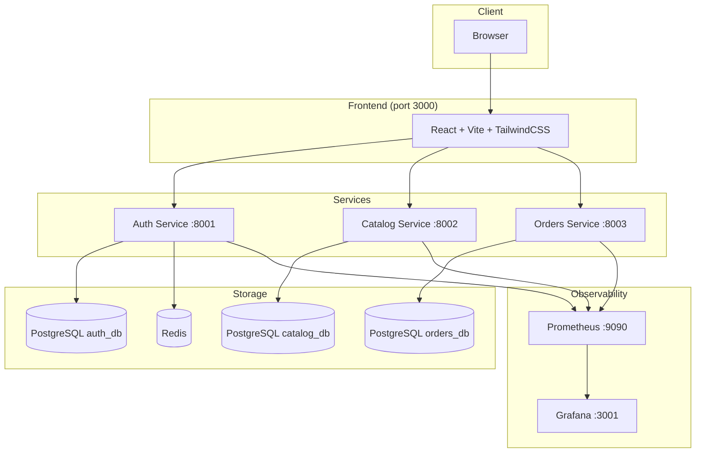

# Microservices Demo

A production-grade microservices monorepo featuring a React storefront backed by three FastAPI services, PostgreSQL databases, Redis session store, and full observability via Prometheus + Grafana.

## Architecture



## Prerequisites

| Tool | Version |
|------|---------|
| Docker + Docker Compose | 24+ |
| Node.js + pnpm | 20+, 9+ |
| Python | 3.12 |
| Vagrant | 2.4+ |
| VirtualBox | 7.0+ |
| Ansible | 2.16+ |
| Terraform | 1.7+ |
| kubectl | 1.29+ |

## Quick Start with Docker Compose

```bash
# Clone and start all services
git clone https://github.com/your-org/microservices-demo.git
cd microservices-demo

docker compose up --build -d

# Tail logs
docker compose logs -f
```

| Service    | URL                          |
|------------|------------------------------|
| Frontend   | http://localhost:3000        |
| Auth API   | http://localhost:8001/docs   |
| Catalog API| http://localhost:8002/docs   |
| Orders API | http://localhost:8003/docs   |
| Prometheus | http://localhost:9090        |
| Grafana    | http://localhost:3001        |

## K3s Cluster Deployment (Vagrant + Ansible + Terraform)

### 1. Boot VMs and provision baseline

```bash
vagrant up
```

This provisions three Ubuntu 22.04 VMs:

| Host       | IP              | Role       |
|------------|-----------------|------------|
| controller | 192.168.56.10   | K3s server |
| worker1    | 192.168.56.11   | K3s agent  |
| worker2    | 192.168.56.12   | K3s agent  |

### 2. Apply Terraform to install K3s

```bash
cd infra/terraform
terraform init
terraform apply -auto-approve
```

### 3. Deploy manifests

```bash
# Copy kubeconfig from controller
vagrant ssh controller -c "sudo cat /etc/rancher/k3s/k3s.yaml" > ~/.kube/k3s-config
export KUBECONFIG=~/.kube/k3s-config

# Create namespace and apply manifests
kubectl create namespace microservices
kubectl apply -f k8s/ --recursive
```

## Database Seeding

Seeds run automatically via Docker Compose (mounted to `/docker-entrypoint-initdb.d/`).

For manual seeding:

```bash
# Auth DB
docker compose exec postgres-auth psql -U user -d auth_db -f /docker-entrypoint-initdb.d/auth.sql

# Catalog DB
docker compose exec postgres-catalog psql -U user -d catalog_db -f /docker-entrypoint-initdb.d/catalog.sql

# Orders DB
docker compose exec postgres-orders psql -U user -d orders_db -f /docker-entrypoint-initdb.d/orders.sql
```

## Demo Credentials

| Account              | Password   | Role  |
|----------------------|------------|-------|
| admin@demo.com       | admin123   | Admin |
| user@demo.com        | user123    | User  |

## Grafana

- **URL**: http://localhost:3001
- **Username**: `admin`
- **Password**: `admin`

The *Microservices Overview* dashboard is auto-provisioned and shows:
- HTTP request rate per service
- Error rate (5xx)
- Response time p99
- Memory usage
- CPU usage

## Chaos Engineering

All Kubernetes workloads carry the label `chaos-mesh-enabled: "true"`. This enables targeted fault injection using [Chaos Mesh](https://chaos-mesh.org/).

Example: inject a 200 ms network delay on the `catalog` deployment:

```yaml
apiVersion: chaos-mesh.org/v1alpha1
kind: NetworkChaos
metadata:
  name: catalog-delay
  namespace: microservices
spec:
  action: delay
  mode: all
  selector:
    namespaces: [microservices]
    labelSelectors:
      app.kubernetes.io/name: catalog
      chaos-mesh-enabled: "true"
  delay:
    latency: "200ms"
    correlation: "25"
    jitter: "10ms"
  duration: "60s"
```

Apply with `kubectl apply -f <file>.yaml`. The Grafana dashboard will surface the impact in real time.

## CI/CD

- **GitHub Actions** (`.github/workflows/ci.yml`): lint → type-check → smoke test → Docker build → Trivy scan
- **GitLab CI** (`.gitlab-ci.yml`): pull images → `kubectl apply` → health-endpoint smoke tests

## Project Layout

```
.
├── services/
│   ├── auth/       FastAPI auth service (JWT + Redis sessions)
│   ├── catalog/    FastAPI product catalog service
│   └── orders/     FastAPI orders service
├── frontend/       React 18 + Vite + TailwindCSS storefront
├── db/seeds/       PostgreSQL seed SQL files
├── k8s/            Kubernetes manifests (namespace: microservices)
├── infra/
│   ├── ansible/    Baseline + K3s provisioning playbooks
│   └── terraform/  K3s cluster Terraform config
├── observability/
│   ├── prometheus/ Prometheus scrape config
│   └── grafana/    Dashboard JSON + provisioning
├── docker-compose.yml
├── Vagrantfile
├── .github/workflows/ci.yml
└── .gitlab-ci.yml
```